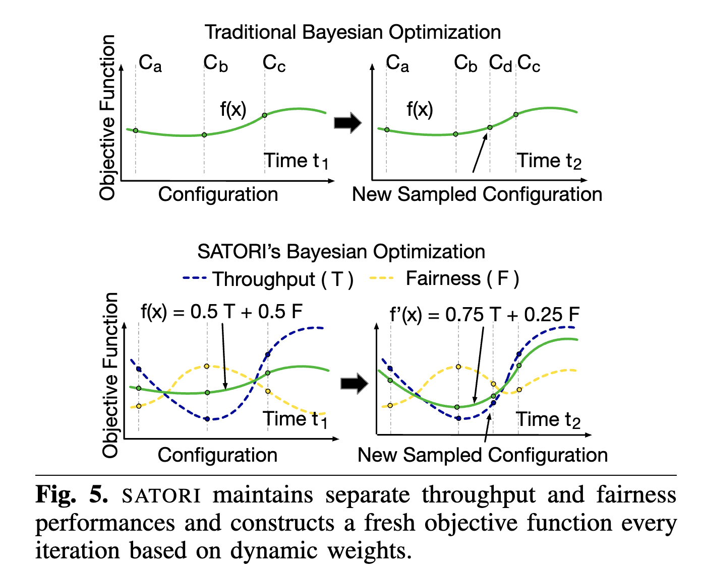

[SATORI: Efficient and Fair Resource Partitioning by Sacrificing Short-Term Benefits for Long-Term Gains](https://github.com/rohanbasuroy/satori)

This paper is written by my potential advisor.

## Introduction

Background: Co-locating workloads can improve resource utilization.

Challenges:

1. The shared resources are complex.
2. Fairness and throughput are two conflicting goals.

Existing Approaches:

1. One shared resource, one goal.
2. Multiple shared resources, one goal. Partition resources one by one.

Contribution:

1. Multiple shared resources are partitioned simultaneously.
2. Consider both fairness and throughput. Utilize Bayesian Optimization, BO.
3. Trade-off one goal for another temporarily can achieve higher returns on both the goals over long-term. (Interesting! How did they find this? How to decide when to sacrifice one goal?) This is done by creating dynamic BO objective functions.

## How did they find this? (one of the most interesting part)

$y$ axis: difference in performance of different resources partition configurations.

$x$ axis: different time period.

From (a) and (b): The difference in throughput is the same, but $C_d$ has better fairness. This means we can have net gain in fairness when prioritizing throughput at $\Delta t_1$ and fairness at $\Delta t_2$.

From (c) and (d): The difference in fairness is the same, but $C_g$ has better throughput. Similar conclusion.

## Design

**Proxy model**: predict the performance of different configurations. Become more accurate during online use.

**Acquisition function**: direct BO how to find the next sample.

**Objective function**: multiple goals and dynamic.

The proxy model and the acquisition function is basically from traditional BO. The fun part lies in the dynamic objective function. SATORI does this by maintaining records of different goals separately and construct the final objective function by combing these two goals using weights. The system considers both equalization and prioritization.

(TODO: add some descriptions of formula)
